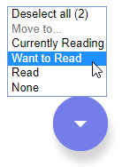

# MyReads Project

This project is a bookshelf app that allows users to catalogize books they've
read, are currently reading, or want to read.  
The frontend is written in React and the utilizes a demo backend server run by
Udacity.

## Running the application

Make sure to have [Node.js](https://nodejs.org/en/) installed.  
Clone the project, install the dependencies and run the development server:

```
git clone https://github.com/laudep/react-project-bookshelf.git
npm install
npm start
```

A new browser window will open automatically.  
By default, the app runs in [http://localhost:3000/](http://localhost:3000/).


## Using the application

- Books are sorted into different categories, each of which are displayed on a different 'shelf'

- Click on the button on the book cover to change a book's category or remove a book from the list
  

- To add new books click the button on the bottom right of the page.  
   Enter a search term. Found books can be added using the buttons on the book covers.
  

- Multiple selection:  
  Click on a book cover to select it. A frame appears around the book.  
  After selecting one or more books the change multiple button appears at the bottom right.  
  Using this button multiple books can be changed at once.  
  

Note: The backend API is limited to a particular set of [search terms](#search-terms)
(see [below](#Important) for more information).

## Backend Server

This project utilizes a backend server provided by Udacity.  
The file [`BooksAPI.js`](src/BooksAPI.js) contains the methods needed to
perform necessary backend operations

- [`getAll`](#getall)
- [`update`](#update)
- [`search`](#search)

### `getAll`

Method Signature:

```js
getAll();
```

- Returns a Promise which resolves to a JSON object containing a collection of book objects.
- This collection represents the books currently in the bookshelves in your app.

### `update`

Method Signature:

```js
update(book, shelf);
```

- book: `<Object>` containing at minimum an `id` attribute
- shelf: `<String>` contains one of ["wantToRead", "currentlyReading", "read"]
- Returns a Promise which resolves to a JSON object containing the response data of the POST request

### `search`

Method Signature:

```js
search(query);
```

- query: `<String>`
- Returns a Promise which resolves to a JSON object containing a collection of a maximum of 20 book objects.
- These books do not know which shelf they are on. They are raw results only. You'll need to make sure that books have the correct state while on the search page.

## Important

The backend API uses a fixed set of cached search results and is limited to a
particular set of search terms, which can be found in
[SEARCH_TERMS.md](SEARCH_TERMS.md). That list of terms are the _only_ terms
that will work with the backend, so don't be surprised if your searches for
Basket Weaving or Bubble Wrap don't come back with any results.

## Create React App

This project was bootstrapped with [Create React App](https://github.com/facebookincubator/create-react-app). You can find more
information on how to perform common tasks [here](https://github.com/facebookincubator/create-react-app/blob/master/packages/react-scripts/template/README.md).
